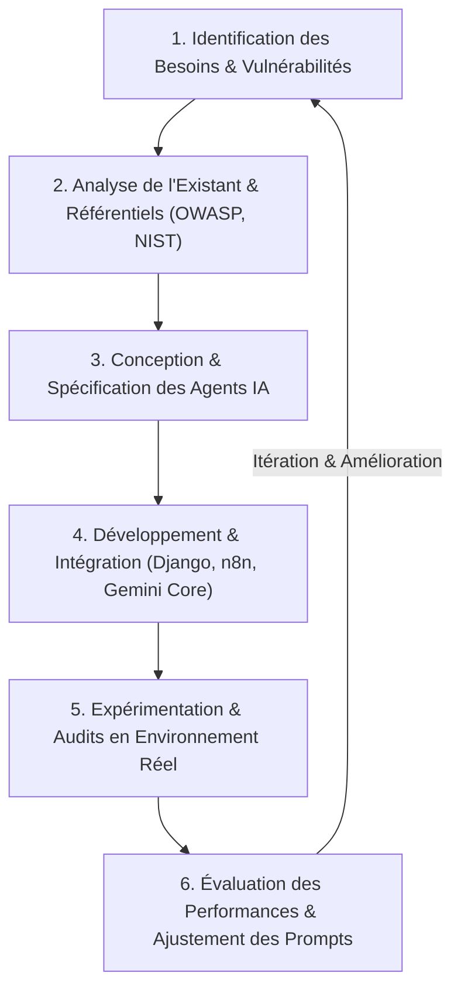
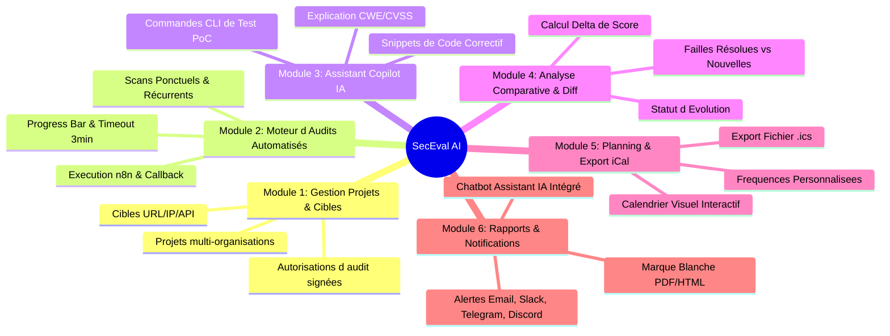
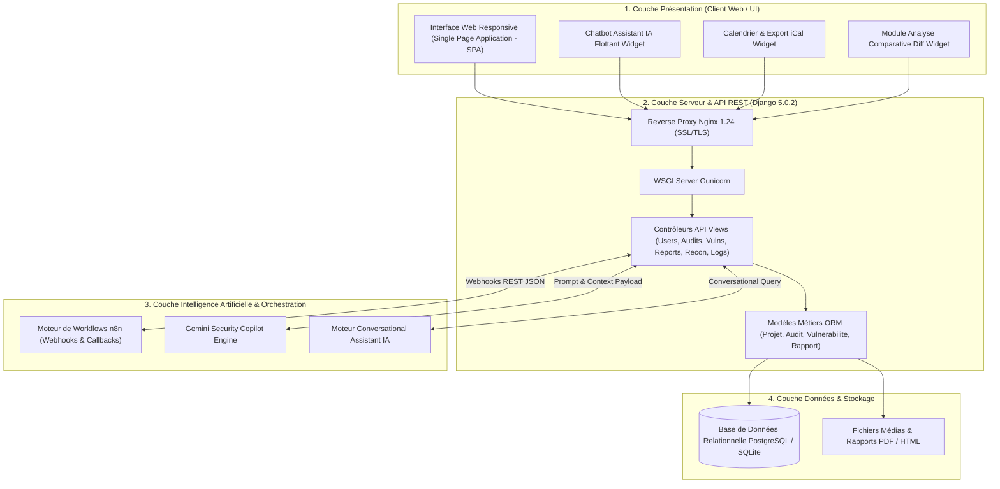
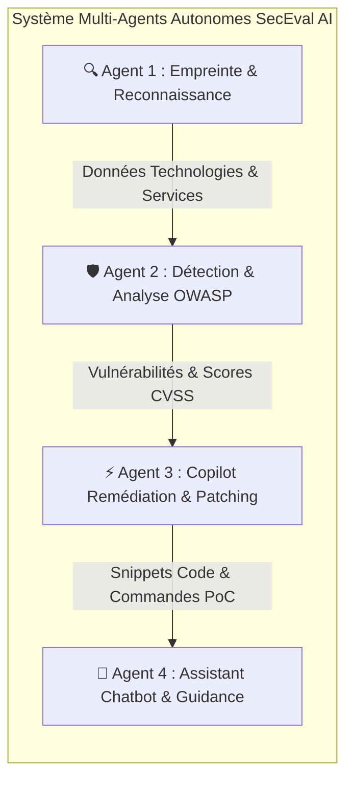
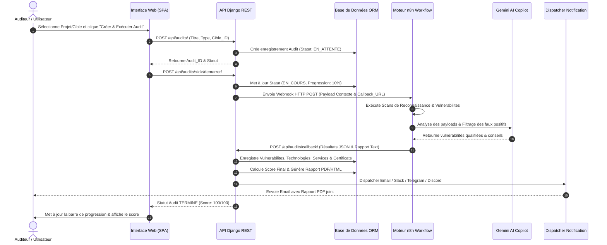

# CHAPITRE II : MÉTHODOLOGIE DE RECHERCHE ET CONCEPTION DU FRAMEWORK DE TEST AUTOMATISÉ

---

## INTRODUCTIONS DU CHAPITRE II

Dans le cadre de mes travaux de recherche au sein de **ZENDAYA TECHNOLOGY**, la conception d'une solution automatisée d'évaluation de la sécurité des applications web impose une démarche rigoureuse. Face à la sophistication croissante des cyberattaques et à la nécessité de réduire la charge mentale et opérationnelle des auditeurs, le développement d'un framework automatisé basé sur des agents d'intelligence artificielle autonomes constitue une réponse innovante.

Ce chapitre est consacré à la présentation de la méthodologie de recherche adoptée, à l'analyse détaillée des besoins fonctionnels et non fonctionnels, à la modélisation de l'architecture logicielle de notre solution **SecEval AI**, ainsi qu'à la spécification des scénarios de test et des mécanismes de contrôle de sécurité régissant le comportement des agents IA.

---

## 1. MÉTHODOLOGIE DE RECHERCHE ET D’AUDIT

### 1.1. Type de recherche (4.1)

Afin d'apporter une réponse concrète aux défis d'évaluation sécuritaire rencontrés par ZENDAYA TECHNOLOGY, j'ai opté pour une **recherche-action appliquée** couplée à une approche d'**ingénierie logicielle axée sur la conception et la preuve de concept (Proof of Concept - PoC)**.

* **Une dimension appliquée** : Mon objectif n'est pas uniquement théorique ; il s'agit de construire une plateforme opérationnelle capable d'exécuter des tests d'intrusion automatisés et assistés par IA sur des infrastructures réelles et en environnement de staging.
* **Une dimension itérative (Recherche-Action)** : La méthodologie repose sur un cycle continu *d'observation, de conception, d'expérimentation et d'ajustement*. Chaque module développé (scanner de reconnaissance, moteur de callbacks n8n, assistant IA Copilot) a été soumis à des tests expérimentaux sur le terrain afin d'en mesurer la précision et la pertinence.

---

### 1.2. Démarche adoptée (4.2)

Pour garantir une rigueur scientifique et industrielle, j'ai aligné la méthodologie d'audit de **SecEval AI** sur les référentiels internationaux reconnus en cybersécurité :

1. **OWASP WSTG v4.2 (Web Security Testing Guide)** : Constitue la colonne vertébrale des scénarios d'évaluation applicative (contrôle d'accès, validation des entrées, cryptographie, gestion des sessions).
2. **NIST SP 800-115 (Technical Guide to Information Security Testing and Assessment)** : Guide l'organisation de l'audit en 4 phases distinctes : *Planification, Découverte, Exécution et Rapport*.
3. **PTES (Penetration Testing Execution Standard)** : Définit les règles d'engagement et la méthodologie d'analyse des risques.
4. **Système de Notation CVSS v3.1 (Common Vulnerability Scoring System)** : Assure un calcul normalisé du score de gravité des failles découvertes (de 0.0 à 10.0).

```mermaid
flowchart LR
    subgraph PHASE_1["Phase 1 : Planification & Périmètre"]
        P1["Création du Projet & Cible"] --> P2["Vérification Autorisation Signée"]
    end

    subgraph PHASE_2["Phase 2 : Découverte & Reconnaissance"]
        P2 --> P3["Empreinte Web & Frameworks"]
        P3 --> P4["Cartographie Ports & Services"]
        P4 --> P5["Inspection Certificats SSL/TLS"]
    end

    subgraph PHASE_3["Phase 3 : Évaluation & Attaque"]
        P5 --> P6["Trigger Workflow Automatisé n8n"]
        P6 --> P7["Analyse Contextuelle IA Copilot"]
    end

    subgraph PHASE_4["Phase 4 : Synthèse & Remédiation"]
        P7 --> P8["Génération Rapport PDF Marque Blanche"]
        P8 --> P9["Diff d'Évolution & Notification Directe"]
    end
```

---

### 1.3. Environnement de test (4.3)

Afin d'évaluer le framework dans des conditions rigoureusement contrôlées et réalistes, j'ai déployé un banc d'essai complet comprenant une infrastructure de production dédiée et des applications cibles vulnérables par conception.

#### Composants de l'environnement :

* **Serveur de Production / VPS Dédié** :
  * **OS** : Ubuntu Server 22.04 LTS (Hébergé sur VPS `93.127.203.72`).
  * **Serveur Web / Reverse Proxy** : Nginx 1.24.0 avec terminaison SSL/TLSv1.3 (Domaine officiel : `https://secu.zendaya.tech`).
  * **Serveur d'Application** : Gunicorn WSGI multi-workers.
  * **Environnement Virtuel** : Python 3.12 & Django 5.0.2.
* **Moteur d'Orchestration Automatisé** :
  * **n8n Automation Engine** (Instance VPS hébergée sur `https://n8n.zendaya.tech`).
* **Cibles d'Évaluation de Test** :
  * Applications web internes de staging ZENDAYA TECHNOLOGY.
  * Instances cibles vulnérables (*OWASP Juice Shop*, *DVWA - Damn Vulnerable Web App*).
  * API REST de test ciblées par injections SQL (CWE-89), XSS (CWE-79) et faiblesses TLS (CWE-326).

---

### 1.4. Critères d’évaluation du framework (4.4)

Pour valider l'efficacité du framework **SecEval AI**, j'ai défini cinq métriques quantitatives et qualitatives majeures :

$$\text{Taux de Détection (Recall)} = \frac{\text{Vraies Failles Détectées}}{\text{Total Failles Réelles en Base}} \times 100$$

$$\text{Précision (Precision)} = \frac{\text{Vraies Failles Détectées}}{\text{Vraies Failles Détectées} + \text{Faux Positifs}} \times 100$$

| Métrique d'Évaluation | Définition & Objectif Métier | Seuil Cible Vise |
| :--- | :--- | :---: |
| **Taux de Détection (Recall)** | Capacité du framework à identifier l'exhaustivité des failles réelles présentées dans les scénarios OWASP Top 10. | **> 95%** |
| **Taux de Faux Positifs** | Proportion d'alertes erronées générées par le scanner ou l'agent IA. | **< 5%** |
| **Précision de Notation CVSS** | Conformation des scores attribués par l'IA avec les standards officiels NVD (National Vulnerability Database). | **$\Delta \le 0.5$ pt** |
| **Temps Moyen d'Exécution** | Durée totale d'une campagne d'audit (Reconnaissance + Scan + Rapport). | **< 3 min / cible** |
| **Taux de Couverture de Remédiation** | Pourcentage de vulnérabilités pour lesquelles l'assistant Copilot IA fournit un patch de code valide et vérifiable. | **> 90%** |

---

## 2. CONCEPTION FONCTIONNELLE DU FRAMEWORK

### 2.1. Besoins fonctionnels (5.1)

L'analyse des exigences menée auprès des équipes techniques de ZENDAYA TECHNOLOGY a permis de regrouper les fonctionnalités du framework en six grands modules métier :

1. **Gestion des Projets, Cibles et Autorisations** :
   * Création et archivage de projets de sécurité par organisation.
   * Déclaration de cibles (URL, IP, API REST) et vérification dynamique de leur accessibilité réseau.
   * Attachement de certificats d'autorisation d'audit légaux.
2. **Exécution et Supervision des Audits** :
   * Lancement d'audits par typologie (*Standard*, *Léger*, *Approfondi*, *API*, *SSL/TLS*).
   * Prise en charge des planifications uniques ou récurrentes (Hebdomadaire, Mensuelle).
   * Barre de progression temps réel avec détection des erreurs n8n et mécanisme anti-blocage (timeout automatique de 3 minutes).
3. **Remédiation Assistée par IA (Gemini Security Copilot)** :
   * Analyse intelligente de chaque vulnérabilité.
   * Génération automatique de conseils de remédiation, de snippets de code correctif (Python/Django, Nginx, JS) et de commandes CLI de validation (`curl`, `nmap`).
4. **Analyse Comparative d'Audits (Diff & Évolution)** :
   * Comparaison côte-à-côte de deux campagnes d'audits (audit initial vs réévaluation).
   * Calcul automatique du delta de score ($\Delta \text{Score}$) et catégorisation des failles (*Résolues*, *Nouvelles*, *Persistantes*).
5. **Planning Visuel et Exportation iCal** :
   * Calendrier interactif regroupant les événements d'audits futurs et passés.
   * Exportation d'un flux iCalendar `.ics` compatible avec Google Calendar, Outlook et Apple Calendar.
6. **Rapports en Marque Blanche, Notifications Multi-Canaux & Chatbot IA** :
   * Génération automatique de rapports PDF/HTML personnalisables aux couleurs de l'entreprise (Logo, couleur thématique, pied de page légal).
   * Dispatcher de notifications en direct sur Email, Slack, Telegram et Discord.
   * **Chatbot Assistant IA Flottant** interactif pour la guidance de l'utilisateur et l'analyse conversationnelle des résultats.

---

### 2.2. Besoins non fonctionnels (5.2)

Les exigences non fonctionnelles garantissent la robustesse industrielle du framework :

* **Performance et Réactivité** : Traitement asynchrone des tâches lourdes via le moteur de workflows, temps de réponse API $\le 200 \text{ ms}$ pour les requêtes de consultation.
* **Sécurité et Confidentialité** : Authentification stricte, gestion des droits basée sur les rôles (RBAC : *Administrateur*, *Auditeur*, *Lecteur*), protection CSRF/XSS et hachage fort des mots de passe en PBKDF2.
* **Résilience et Tolérance aux Panne** : Mécanisme d'autoguérison en cas d'interruption du webhook n8n (reprise sur timeout au bout de 180 secondes sans blocage du serveur d'application).
* **Traçabilité et Auditabilité** : Enregistrement immuable de chaque action utilisateur et de chaque requête système dans le `JournalActivite` (Horodatage, Utilisateur, Action, Adresse IP, Ressource impactée).

---

### 2.3. Architecture générale du framework (5.3)

J'ai conçu **SecEval AI** selon une architecture en couches découpée et moderne, favorisant la scalabilité et la séparation des responsabilités.

---

### 2.4. Rôle des agents IA autonomes (5.4)

Au cœur du framework **SecEval AI**, l'intelligence artificielle n'intervient pas comme un simple script monolithique, mais à travers une **organisation multi-agents spécialisés** travaillant de manière concertée :

1. **Agent 1 : Agent de Reconnaissance & Cartographie Tech** :
   * *Rôle* : Analyser les entêtes HTTP, identifier la stack logicielle (Frameworks, Web Server, DB) et inspecter la chaîne de certificats SSL/TLS.
2. **Agent 2 : Agent d'Évaluation & Détection des Vulnérabilités** :
   * *Rôle* : Traiter les données de scan brutes reçues via le webhook n8n, éliminer les faux positifs évidents et attribuer une sévérité CVSS et un code CWE normalisé.
3. **Agent 3 : Agent Copilot de Remédiation (Gemini Core)** :
   * *Rôle* : Générer des correctifs de code prêts à l'emploi (*ORM safe queries*, en-têtes CSP/HSTS, sanitization) et fournir la commande de vérification CLI associée.
4. **Agent 4 : Agent Chatbot Assistant & Guidance Application** :
   * *Rôle* : Répondre aux requêtes en langage naturel des auditeurs, expliquer l'origine d'une faille, résumer les scores exécutifs et piloter la navigation de l'interface utilisateur.

---

## 3. MODÉLISATION DES SCÉNARIOS DE TEST

### 3.1. Workflow général d'exécution (6.1)

Le diagramme de séquence ci-dessous illustre le flux complet d'exécution d'un audit de sécurité automatisé au sein du framework, depuis l'initialisation par l'utilisateur jusqu'au callback n8n et la mise à jour des rapports.

---

### 3.2. Scénarios de tests retenus (6.2)

J'ai sélectionné cinq scénarios de test majeurs correspondant aux failles les plus critiques du classement OWASP Top 10 2025 et aux défis d'infrastructure :

| ID Scénario | Intitulé du Scénario | Catégorie OWASP / CWE | Vecteur d'Attaque Testé | Comportement Attendu du Framework |
| :---: | :--- | :--- | :--- | :--- |
| **ST-01** | **Injection SQL sur Formulaire d'Authentification** | OWASP A03 / `CWE-89` | Injection de payloads type `' OR '1'='1` dans les paramètres d'entrée. | Détection de la vulnérabilité, génération par Copilot du code à requêtes préparées (`ORMs`). |
| **ST-02** | **Cross-Site Scripting (XSS) Réfléchi** | OWASP A03 / `CWE-79` | Injection de scripts HTML/JS (``) dans les URLs. | Détection du défaut d'échappement, recommandation d'en-têtes CSP stricts. |
| **ST-03** | **Faiblesse Chiffrement SSL/TLS** | OWASP A02 / `CWE-326` | Test d'acceptation de protocoles obsolètes (TLS 1.0, SSLv3) et ciphers faibles. | Identification du certificat/cipher vulnérable, génération de la conf Nginx sécurisée. |
| **ST-04** | **Broken Object Level Authorization (BOLA API)** | OWASP A01 / `CWE-285` | Modification des identifiants d'objets dans les endpoints d'API REST. | Détection du défaut d'autorisation, recommandation de contrôle d'accès RBAC. |
| **ST-05** | **Gestion des Pannes & Resynchronisation Callback** | Panne Système / Timeout | Simulation d'une coupure du serveur n8n pendant un scan actif. | Déclenchement automatique du timeout au bout de 180s, libération du verrou d'audit. |

---

### 3.3. Règles de contrôle et de sécurité (6.3)

Afin d'éviter tout dommage accidentel ou utilisation malveillante du framework, j'ai mis en place un ensemble de garde-fous stricts (*Guardrails*) :

1. **Principe de l'Autorisation Préalable Obligatoire** :
   * Un audit ne peut être démarré que si la cible est rattachée à un projet disposant d'un document d'autorisation d'audit validé (`AutorisationCible.valide = True`).
2. **Strict Découpage du Périmètre (Scope Fencing)** :
   * Les agents d'audit n'exécutent aucune requête en dehors des adresses IP ou noms de domaine explicitement déclarés dans le projet.
3. **Interdiction des Actions Destructives (Non-Disruption Rule)** :
   * Le framework interdit l'exécution de requêtes de type *Denial of Service (DoS/DDoS)*, de suppression de bases de données (`DROP TABLE`) ou d'altération de fichiers système.
4. **Journalisation Inviolable & Superviseur Humain (Human-in-the-Loop)** :
   * Toutes les requêtes envoyées et les décisions de l'IA sont consignées dans le journal d'activité.
   * L'auditeur humain conserve le contrôle final pour valider ou classer en faux positif n'importe quelle alerte.

---

## TRANSITION DU CHAPITRE II

Au terme de ce chapitre consacré à la méthodologie de recherche et à la conception théorique et fonctionnelle du framework **SecEval AI**, j'ai établi un modèle d'architecture clair, modulable et sécurisé. La combinaison d'un backend robuste en Django, d'un moteur d'orchestration dynamique n8n et de quatre agents IA autonomes spécialisés permet de répondre aux exigences de rapidité, de précision et de traçabilité fixées par ZENDAYA TECHNOLOGY.

Le **Chapitre III** sera consacré à la **mise en œuvre technique, au déploiement opérationnel et à la validation expérimentale** du framework. J'y détaillerai l'implémentation concrète des modèles de données, le code des contrôleurs API, la configuration des conteneurs et du serveur VPS de production, ainsi que l'analyse des résultats obtenus lors des campagnes de tests réelles.
