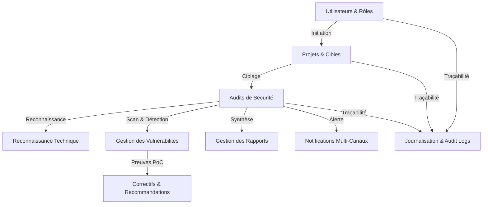

# 🛡️ SecEval AI - Framework d'Évaluation Automatique de Sécurité Web

[](https://www.djangoproject.com/)
[](https://www.python.org/)
[](https://owasp.org/)
[](https://pytest.org/)

**SecEval AI** est une solution complète, modulaire et hautement sécurisée d'évaluation automatique de la sécurité des applications web. Basée sur le framework **Django**, la plateforme permet la gestion intégrale du cycle de vie des audits de sécurité, de la reconnaissance technique jusqu'au reporting exécutif et à la notification multi-canal des équipes d'ingénierie.

---

## 📐 Architecture & Diagrammes PlantUML

La plateforme se compose de **8 modules complémentaires** :



### 1. 👥 Gestion des Utilisateurs (`users`)
- **Modèles** : `Utilisateur`, `Role`, `Permission`, `CodeVerification`
- **Statuts Utilisateur** : `ACTIF`, `INVITE`, `SUSPENDU`, `BLOQUE`, `DESACTIVE`
- **Méthodes clés** : `inscrire()`, `seConnecter()`, `seDeconnecter()`, `renouvelerMotDePasse()`, `modifierProfil()`

### 2. 📁 Gestion des Projets (`projects`)
- **Modèles** : `Projet`, `Cible`, `AutorisationCible`, `MembreProjet`
- **Statuts Projet** : `BROUILLON`, `ACTIF`, `SUSPENDU`, `ARCHIVE`
- **Types de Cibles** : `URL`, `DOMAINE`, `ADRESSE_IP`, `API_REST`, `API_GRAPHQL`
- **Environnements** : `DEVELOPPEMENT`, `TEST`, `PREPRODUCTION`, `PRODUCTION`, `LABORATOIRE`
- **Méthodes clés** : `creer()`, `modifier()`, `archiver()`, `supprimer()`, `verifierAccessibilite()`, `verifierAutorisation()`

### 3. 🛡️ Gestion des Audits (`audits`)
- **Modèles** : `Audit`, `PlanAudit`, `EtapeAudit`
- **Types d'Audit** : `LEGER`, `STANDARD`, `APPROFONDI`, `API`, `SSL_TLS`, `CONFIGURATION`
- **Statuts d'Audit** : `EN_ATTENTE`, `PLANIFICATION`, `EN_COURS`, `TERMINE`, `PARTIEL`, `ECHOUE`, `ANNULE`
- **Méthodes clés** : `demarrer()`, `mettreEnPause()`, `arreter()`, `terminer()`, `calculerScore()`, `ajouterEtape()`, `reordonnerEtapes()`

### 4. 🔍 Reconnaissance Technique (`recon`)
- **Modèles** : `TechnologieDetectee`, `ServiceDetecte`, `CertificatSSL`
- **Fonctionnalités** : Empreinte de pile logicielle, scan de ports et services réseau (open/filtered), inspection approfondie des certificats SSL/TLS et de leurs émetteurs (CA).

### 5. ⚠️ Gestion des Vulnérabilités (`vulns`)
- **Modèles** : `Vulnerabilite`, `Preuve`, `Recommandation`
- **Sévérités (CVSS)** : `CRITIQUE`, `ELEVEE`, `MOYENNE`, `FAIBLE`, `INFORMATION`
- **Statuts Vulnérabilité** : `NOUVELLE`, `A_VERIFIER`, `CONFIRMEE`, `FAUX_POSITIF`, `CORRECTION_EN_COURS`, `CORRIGEE`, `RISQUE_ACCEPTE`
- **Méthodes clés** : `classifier()`, `confirmer()`, `marquerFauxPositif()`, `marquerCorrigee()`

### 6. 📄 Gestion des Rapports (`reports`)
- **Modèles** : `Rapport`
- **Formats d'Export** : `PDF`, `HTML`, `JSON`, `CSV`
- **Statuts Rapport** : `BROUILLON`, `EN_REVISION`, `VALIDE`, `REJETE`, `PUBLIE`
- **Méthodes clés** : `generer()`, `valider()`, `publier()`, `telecharger()`

### 7. 🔔 Notifications Multi-Canaux (`notifications_app`)
- **Modèles** : `Notification`
- **Canaux d'Envoi** : `EMAIL`, `SLACK`, `TELEGRAM`, `DISCORD`
- **Méthodes clés** : `envoyer()`

### 8. 📜 Journalisation & Piste d'Audit (`logs_app`)
- **Modèles** : `JournalActivite`
- **Méthodes clés** : `enregistrer(utilisateur, action, ressource, details, adresseIP, projet, audit)`

---

## ⚙️ Installation & Configuration

### Prérequis
- **Python** 3.10 ou supérieur
- **pip** et **virtualenv**

### 1. Cloner le Projet & Créer l'Environnement Virtuel
```powershell
# Déplacement dans le répertoire du projet
cd "projet master"

# Création de l'environnement virtuel
python -m venv venv

# Activation de l'environnement virtuel (Windows PowerShell)
.\venv\Scripts\Activate.ps1
```

### 2. Installer les Dépendances
```powershell
pip install -r requirements.txt
```

### 3. Exécuter les Migrations de la Base de Données
```powershell
python manage.py makemigrations users projects audits recon vulns reports notifications_app logs_app
python manage.py migrate
```

### 4. Injecter les Seeders de Démonstration (Jeu de données de test)
```powershell
python manage.py seed_users
python manage.py seed_projects
python manage.py seed_audits
python manage.py seed_recon
python manage.py seed_vulns
python manage.py seed_reports
python manage.py seed_notifications
python manage.py seed_logs
```

---

## 🚀 Démarrage du Serveur & Interface Web

### Lancer le Serveur de Développement
```powershell
python manage.py runserver
```

Le serveur s'exécute par défaut sur : `http://127.0.0.1:8000/`

### Accès aux Interfaces Web

1. **Page de Connexion Dédiée** :
   - URL : [`http://127.0.0.1:8000/web/login/`](http://127.0.0.1:8000/web/login/)
   - Identifiants de test pré-créés :
     - **Admin** : `admin@seceval.io` / `AdminPassword123!`
     - **Auditeur** : `auditeur@seceval.io` / `AuditeurPass123!`
     - **Lecteur** : `lecteur@seceval.io` / `LecteurPass123!`

2. **Tableau de Bord SPA (Single Page Application)** :
   - URL : [`http://127.0.0.1:8000/web/`](http://127.0.0.1:8000/web/)
   - Contient la navigation réactive pour les 8 modules métier (Dashboard, Journal d'activité, Notifications, Rapports, Vulnérabilités & PoC, Reconnaissance, Audits, Projets, Utilisateurs, Rôles et Profil).

3. **Interface d'Administration Django** :
   - URL : [`http://127.0.0.1:8000/admin/`](http://127.0.0.1:8000/admin/)

---

## 📡 API REST Endpoints Reference

| Module | Endpoint | Méthodes HTTP | Description |
| :--- | :--- | :--- | :--- |
| **Authentification** | `/api/users/login/` | `POST` | Authentification utilisateur |
| | `/api/users/logout/` | `POST` | Déconnexion |
| | `/api/users/profile/` | `GET`, `PATCH` | Consultation & modification du profil |
| **Projets & Cibles** | `/api/projects/` | `GET`, `POST` | Liste & création de projets |
| | `/api/projects/<id>/cibles/` | `GET`, `POST` | Gestion des cibles par projet |
| | `/api/projects/cibles/<id>/autorisations/` | `POST` | Enregistrement de l'autorisation de test |
| **Audits** | `/api/audits/` | `GET`, `POST` | Liste & démarrage des campagnes d'audit |
| | `/api/audits/<id>/demarrer/` | `POST` | Action `demarrer()` d'un audit |
| | `/api/audits/<id>/terminer/` | `POST` | Action `terminer()` et calcul de score |
| **Reconnaissance** | `/api/recon/audit/<id>/` | `GET` | Technologies, services et certificats SSL |
| | `/api/recon/audit/<id>/scan/` | `POST` | Empreinte automatique par l'Agent IA |
| **Vulnérabilités** | `/api/vulns/` | `GET`, `POST` | Liste & signalement des failles |
| | `/api/vulns/<id>/confirmer/` | `POST` | Confirmation d'une vulnérabilité |
| | `/api/vulns/<id>/corrigee/` | `POST` | Marquage d'une faille comme corrigée |
| **Rapports** | `/api/reports/` | `GET`, `POST` | Génération de rapports HTML, JSON, PDF, CSV |
| | `/api/reports/<id>/telecharger/` | `GET` | Téléchargement du fichier de rapport |
| **Notifications** | `/api/notifications/` | `GET`, `POST` | Expédition d'alertes Email/Slack/Telegram/Discord |
| **Journalisation** | `/api/logs/` | `GET`, `POST` | Consultation & traçabilité de la piste d'audit |

---

## 🧪 Assurance Qualité & Tests Automatisés

La plateforme inclut une suite de tests unitaires et d'intégration validant les calculs de scores, les transitions de statuts et la persistance.

Pour exécuter l'ensemble des 62 tests unitaires :

```powershell
python manage.py test logs_app notifications_app reports vulns recon audits projects users
```

**Résultat de validation** :
```text
Ran 62 tests in 27.013s
OK
```

---

## 🔒 Sécurité & Bonnes Pratiques
- Mots de passe hachés via **PBKDF2 SHA256**.
- Protection contre les injections SQL via Django ORM.
- Sécurisation CSRF sur les endpoints d'authentification.
- Encodage UTF-8 obligatoire sur les réponses JSON (`ensure_ascii=False`).
- Conformité OWASP sur le reporting des preuves PoC.
